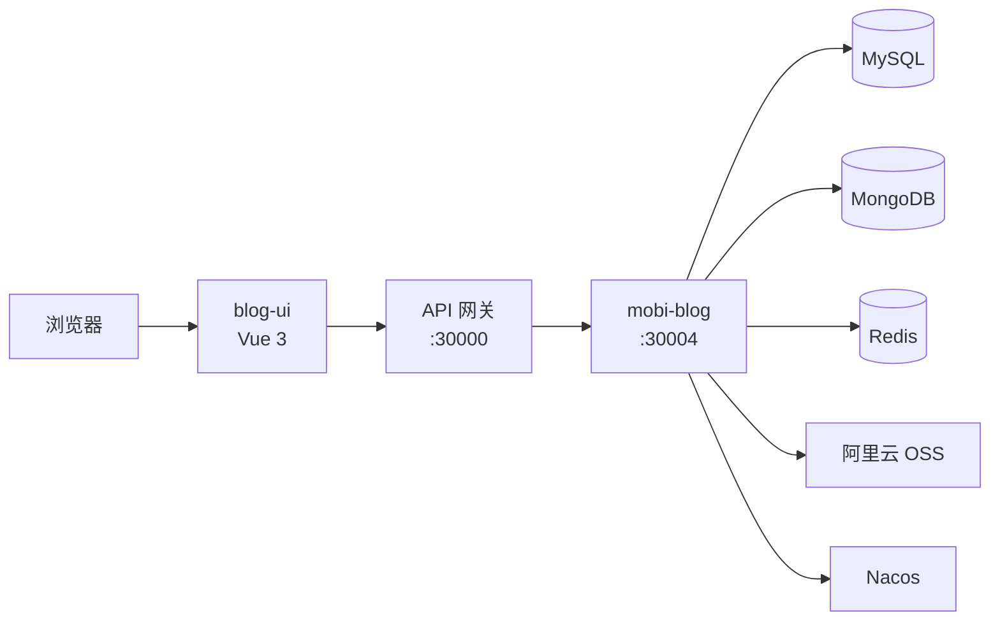

# Mobi Blog

一个前后端分离的个人博客系统，支持文章发布、评论互动、收藏夹管理与管理后台。前端基于 Vue 3，后端基于 Spring Boot，文章内容存储于 MongoDB，用户与收藏数据存储于 MySQL。

## 功能特性

### 读者端

- 热门 / 最新文章浏览
- 按分类、标签筛选与全文搜索
- Markdown 文章阅读
- 评论发表与互动
- 自定义收藏夹，收藏喜欢的文章
- 邮箱注册 / 登录，支持验证码与密码重置

### 管理端

- 数据统计面板
- Markdown 编辑器发布文章，支持草稿保存
- 文章、评论、用户管理
- 角色权限控制（`MASTER` / `ADMIN`）
- 管理员操作日志

### 界面

- Element Plus 组件库
- 季节主题与粒子动效
- 响应式布局，侧边栏展示标签云、最新评论等

## 技术栈

| 层级 | 技术 |
|------|------|
| 前端 | Vue 3、Vite、Vue Router、Pinia、Element Plus、md-editor-v3、Axios |
| 后端 | Spring Boot 3.2、Spring Security、Spring Data MongoDB、MyBatis-Plus |
| 数据存储 | MySQL（用户 / 收藏）、MongoDB（文章 / 评论）、Redis |
| 基础设施 | Nacos（配置中心 & 服务发现）、阿里云 OSS、邮件服务 |

## 项目结构

```
blog/
├── blog-ui/          # 前端（Vue 3 + Vite）
│   ├── src/
│   │   ├── api/          # 接口封装
│   │   ├── components/   # 通用组件
│   │   ├── layout/       # 页面布局
│   │   ├── router/       # 路由配置
│   │   ├── store/        # Pinia 状态
│   │   └── views/        # 页面视图
│   └── vite.config.js
└── mobi-blog/        # 后端（Spring Boot）
    └── src/main/java/com/xcz/blog/
        ├── controller/   # REST 接口
        ├── service/      # 业务逻辑
        ├── domain/       # 实体与 DTO
        ├── repository/   # MongoDB 仓储
        └── mapper/       # MyBatis Mapper
```

## 系统架构



## 环境要求

- **JDK** 21+
- **Node.js** 18+
- **Maven** 3.8+
- **MySQL** 8.x
- **MongoDB** 6.x
- **Redis** 6.x
- **Nacos** 2.x

> 后端依赖内部公共模块（`com.xcz.commons`），本地开发前需先安装或配置对应依赖。

## 快速开始

### 1. 克隆项目

```bash
git clone https://github.com/jicenwua/mobi_blog.git
cd mobi_blog
```

### 2. 配置 Nacos

在 Nacos 中创建配置文件 `mobi-blog.yaml`（Group: `MINI_APP`），参考 `mobi-blog/src/main/resources/application.yaml` 中的注释，配置以下项：

- MySQL 数据源
- MongoDB 连接
- Redis
- 邮件服务（SMTP）
- JWT 密钥
- 阿里云 OSS

设置环境变量：

```bash
export NACOS_USERNAME=your_username
export NACOS_PASSWORD=your_password
```

### 3. 启动后端

```bash
cd mobi-blog
./mvnw spring-boot:run
```

服务默认监听 `http://localhost:30004`。

### 4. 启动前端

```bash
cd blog-ui
npm install
npm run dev
```

开发服务器默认运行在 `http://localhost:5174`，API 请求通过 Vite 代理转发至网关 `http://localhost:30000`。

### 5. 生产构建

```bash
# 前端
cd blog-ui
npm run build

# 后端
cd mobi-blog
./mvnw clean package -DskipTests
```

前端构建产物位于 `blog-ui/dist`，可通过 Nginx 部署并将 `/prod-api` 反向代理至网关。

## 主要接口

| 模块 | 路径前缀 | 说明 |
|------|----------|------|
| 认证 | `/blog/auth` | 注册、登录、验证码、重置密码 |
| 文章 | `/blog/article` | 发布、查询、搜索、草稿、封面上传 |
| 评论 | `/blog/comment` | 发表、删除、分页查询 |
| 收藏 | `/blog/favorite` | 收藏夹 CRUD、文章收藏 |
| 管理 | `/blog/admin` | 统计、文章 / 评论 / 用户管理、日志 |

## 文章分类

| 标识 | 名称 |
|------|------|
| `database` | 数据库 |
| `middleware` | 中间件 |
| `spring` | Spring 框架 |
| `ai` | AI |

## 开发说明

### 前端代理

开发环境下，`/dev-api` 会被代理到 `http://localhost:30000`（见 `blog-ui/vite.config.js`）。可在 `.env.development` 中修改 `VITE_APP_BASE_API`。

### 权限模型

- 普通用户：浏览、评论、收藏
- `ADMIN`：管理后台全部功能
- `MASTER`：在 `ADMIN` 基础上可修改用户角色

## License

本项目仅供学习交流使用。
